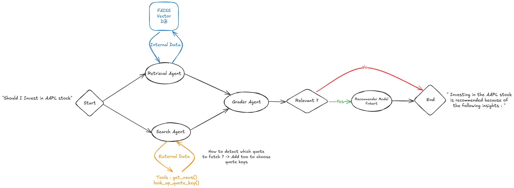
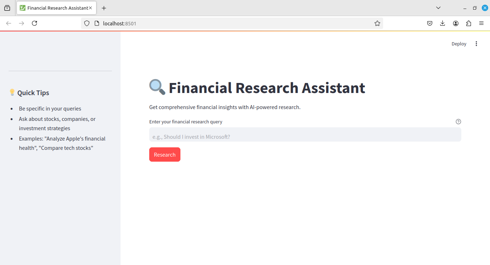

## Overview

<div align="center">

</div>

This project provides a comprehensive framework for retrieving, processing, and analyzing financial data, with a focus on SEC reports and stock market information. The system leverages FAISS for efficient similarity search, integrates Yahoo Finance for real-time market data, and automates SEC report retrieval and embedding for financial analysis.

## Features
- **Streamlit Dashboard**: Provides an interactive web application for financial data visualization.
- **Automated SEC Reports Retrieval**: Scrapes and processes SEC reports for financial insights.
- **Vector Search with FAISS**: Uses FAISS indexing for efficient similarity searches on financial data.
- **Yahoo Finance Integration**: Fetches real-time market data for analysis.
- **Orchestrated Agent Workflow**: Manages multiple processing steps for efficient data handling.

## Project Structure
```
├── app
│   ├── app.py                  # Streamlit application script
│
├── data
│   ├── chunks.json             # Preprocessed SEC report chunks
│   ├── faiss_index.bin         # FAISS index for vector search
│   ├── quick-ticker-symbol-list.pdf  # List of stock tickers
│   ├── quote_keys.csv          # Keys for financial data extraction
│   ├── sec_reports             # Folder containing downloaded SEC reports
│   ├── ticker_info.csv         # Processed stock ticker information
│
├── env                         # Python virtual environment
│
├── scripts
│   ├── __init__.py             # Script package initialization
│   ├── orcherstrator_agent.py  # Main orchestrator for pipeline execution
│   ├── pdf_tickers_to_csv.py   # Converts PDFs to structured CSVs
│   ├── sec_reports_embedding.py  # Embeds SEC reports into vector space
│   ├── sec_reports_retrieval.py  # Retrieves SEC reports
│   ├── sec_reports_retreival_agent.py  # Agent for managing SEC retrieval
│   ├── sec_reports_scraper.py  # Scrapes SEC reports from online sources
│   ├── yfinance_search_agent.py  # Fetches stock market data
│   ├── yfinance_tools.py       # Utility functions for Yahoo Finance API
│
├── README.md                   # Project documentation
├── requirements.txt             # Python dependencies
├── setup.py                     # Package setup file
├── system_design.png            # System architecture diagram
```

## Installation
1. Clone the repository:
   ```bash
   git clone <repo-url>
   cd <repo-name>
   ```
2. Create a virtual environment and activate it:
   ```bash
   python3 -m venv env
   source env/bin/activate
   ```
3. Install dependencies:
   ```bash
   pip install -r requirements.txt
   ```

## Usage
### Running the Streamlit Application
Launch the Streamlit dashboard for interactive financial data analysis:
```bash
streamlit run app/app.py
```

<div align="center">

</div>

### Running Data Processing Scripts
To retrieve SEC reports manually:
```bash
python scripts/sec_reports_retrieval.py
```
To fetch stock market data using Yahoo Finance:
```bash
python scripts/yfinance_search_agent.py
```

## System Design
Refer to `system_design.png` for an overview of the architecture and workflow of the system.

## Contributing
Contributions are welcome! Feel free to fork this repository, submit issues, or create pull requests.

## License
This project is licensed under the MIT License.